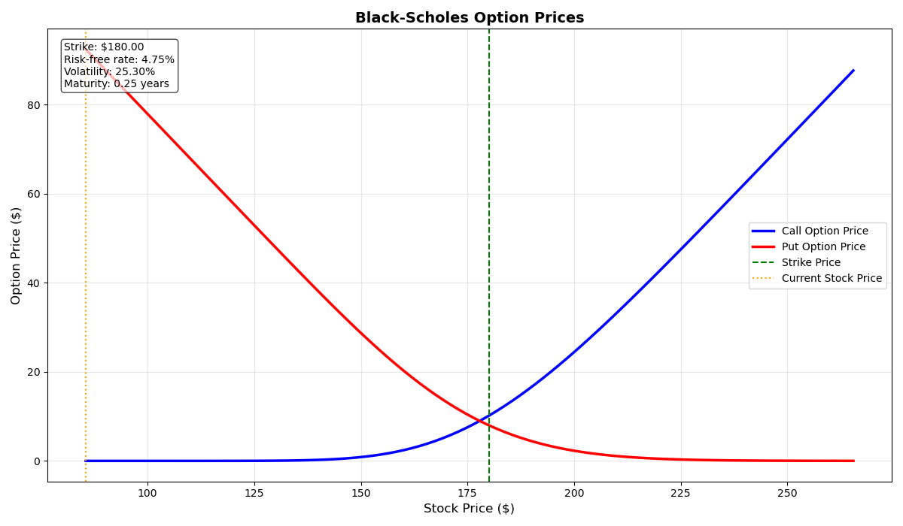

# Simple Black-Scholes Option Pricing Calculator


[](https://doi.org/10.5281/zenodo.15092764)

A simple interactive Black-Scholes option pricing calculator with both command-line and interactive menu interfaces.

## Features

- Calculate European call and put option prices using the Black-Scholes model
- Interactive menu with parameter explanations
- Visualize option prices across a range of stock prices
- Works both in terminal and Jupyter notebook environments
- Detailed explanations of the Black-Scholes model and parameters

## Installation

1. Clone this repository:
   ```bash
   git clone https://github.com/sandyherho/interactiveSimpleBlackScholes
   cd interactiveSimpleBlackScholes
   ```

2. Install required dependencies:
   ```bash
   pip install numpy scipy matplotlib pandas
   ```

## Usage

### Interactive Mode
```bash
python interactiveVanillaBlackScholes.py
```

### Command Line Mode
```bash
python interactiveVanillaBlackScholes.py \
  --stock_price 175.50 \
  --strike_price 180.00 \
  --risk_free_rate 0.0475 \
  --volatility 0.253 \
  --time_to_maturity 0.25 \
  --plot
```

### In a Python script or notebook
```python
from interactiveVanillaBlackScholes import black_scholes_calculator

results = black_scholes_calculator(
    stock_price=175.50,
    strike_price=180.00,
    risk_free_rate=0.0475,
    volatility=0.253,
    time_to_maturity=0.25,
    plot=True
)
```

## Example Output
 *(Example plot showing option prices vs. stock price)*

## License
This project is licensed under the WTFPL (Do What The F*** You Want To Public License). See [LICENSE.txt](LICENSE.txt) for details.
